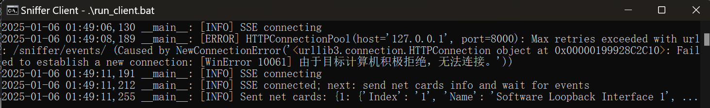
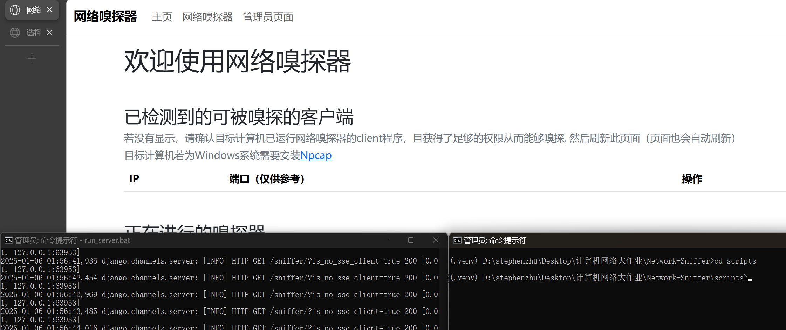
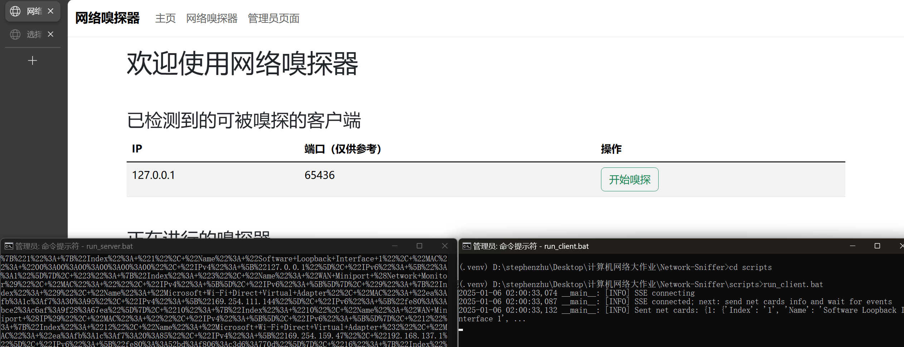
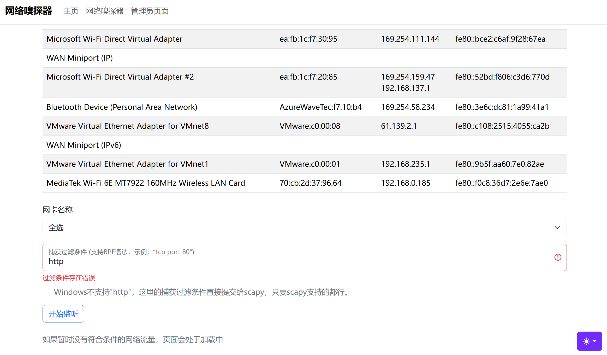
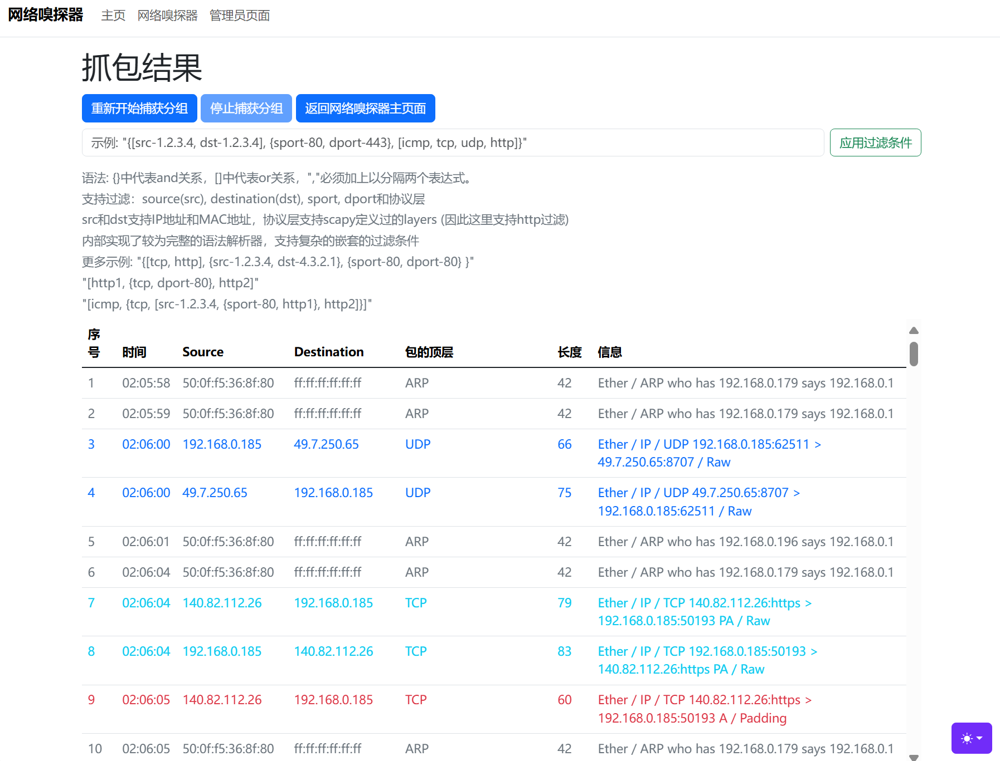
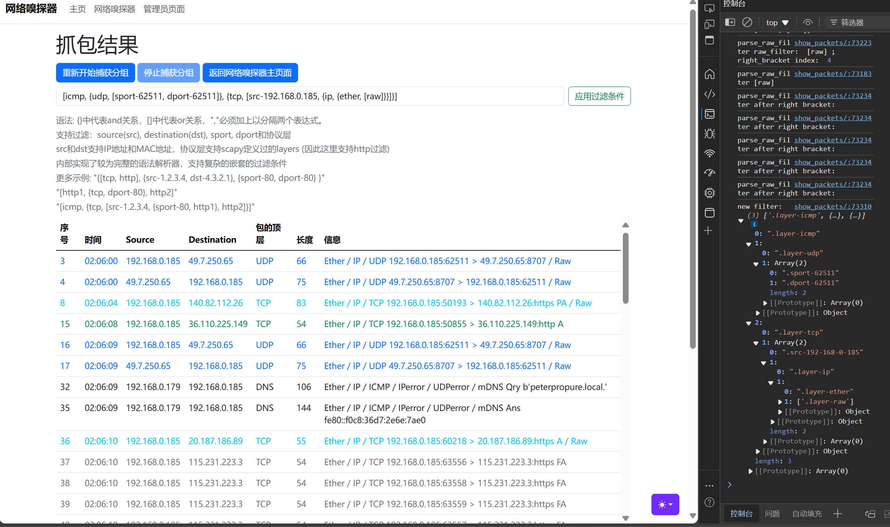

# 计算机通信网络大作业-主文档

## 概述

本项目主要实现了网络嗅探器。

项目框架：

1. 本项目中共有3类实体
   1. 服务端（server）
      1. 与客户端交互
      2. 储存嗅探结果
      3. 提供嗅探结果展示和分析
   2. 网络流量被监听的客户端（以下也称为monitered client或m-client）
      1. 向服务端发送被监听到的符合条件的包
   3. 网站访问者（以下也称为user-client）
2. 基本通信/交互逻辑（为理解写成线性的逻辑，实际实现是异步的、并行的）
   1. user-client通知server要监听的m-client
   2. server通知m-client准备开始监听
   3. m-client向server请求过滤条件
   4. user-client向server提交过滤条件
   5. server向m-client发送过滤条件
   6. m-client向server发送符合条件包
   7. server向user-client实时呈现获得的包
   8. user-client可向server发送停止、重新开始等命令
3. 包分析
   1. 尝试模拟Wireshark的部分功能
   2. 提供包的基本信息（时间、source、destination、长度、协议、概要）
   3. 提供包的每层协议的字段解析
   4. 根据着色规则对满足不同条件的包进行着色，以便区分
   5. 支持对source(src), destination(dst), sport, dport和协议层的复杂的嵌套的显示过滤
      - 注：“显示过滤”和抓包初始设置的”捕获过滤“是两个概念


项目实现简介：

1. 使用scapy库进行嗅探，因为其支持复杂的网络流量分析

2. 基于Django搭建了服务端，以网站的形式为用户提供友好的UI界面和交互体验

3. server和m-client的通信：除了http协议的m-client向server请求的模式，额外添加 Server-Send Events (SSE) 方法，以支持server主动向m-client推送一些指令，避免m-client轮询

   1. m-client使用sseclient-py库
   2. server使用django_eventsource库

   - 注：另一种通信方式websocket也可以

4. Django所有视图均为异步视图，以支持大量的server和m-client通信

5. m-client向server传输包时，为保留对scapy的强大功能的利用和处理的方便，将`scapy.Packet`python数据结构以base64编码进行传输

6. 当user-client查看包时，server将包结构化，并进行解析字段、着色等操作，而将包的显示过滤完全交给user-client实时完成，以加速用户端的呈现。


项目特点：

1. m-client
   1. 鲁棒的、流式的SSE客户端接收和处理
   2. 监听包和向server发送包分成两个线程，避免漏包
   3. 支持多个监听包的会话
2. server
   1. 自动寻找m-client
   2. 良好的异步处理
   3. 实现不刷新用户页面的页面内容更新，提高用户查看包的体验
3. JavaScript实现理论完备的显示过滤条件语法解析器，理论上支持任意的逻辑关系嵌套
4. 优秀的用户界面设计，优秀的用户交互设计，力图保证用户使用体验感
5. 良好的错误处理逻辑


## 运行程序

见[Network-Sniffer/README.md](.\\Network-Sniffer\\README.md)


简单的使用说明：

1. server默认端口8000，同一局域网下都可访问
2. server提供“管理员页面”
   - 用户名：admin
   - 密码：admin
3. 数据库后端使用SQLite，项目已提供测试用的SQLite数据库文件`/server/db.sqlite3`

更详细的说明在网页中都写好了。


## 大模型交互过程

本项目主要利用CodeGeex进行了以下操作：

1. 部分代码自动填充
2. 通过注释生成部分代码
3. 部分代码注释生成
4. 部分文档生成

不存在直接问AI并复制黏贴某个函数或功能。


示例：

1. 根据代码生成`send_msg`注释

```python
def send_msg(msg_type: MsgType, msg, url, is_post, timeout=None, session: requests.Session=None):
    if session is None:
        session = requests.Session()

    data = {'type': msg_type.value, 'data': msg}
    response = None
    if is_post:
        response = session.post(url, data=data, timeout=timeout)
        Logger.debug(f"request data: {data}")
    else:
        response = session.get(url, params=data, timeout=timeout)
    Logger.debug(f"response: {response}")
    return response
```

```python
'''Send message to server.

use session to imporve performance.

Args:
    msg_type (MsgType): message type
    msg (dict): message data
    url (str): server url
    is_post (bool): whether to use post method
    timeout (int, optional): request timeout. Defaults to None.
    session (requests.Session, optional): requests session
Returns:
    requests.Response: server response
'''
```

2. 部分代码自动填充：根据字段名称自动补全字段类型

```python
    ip = models.GenericIPAddressField(verbose_name="IP地址")
    # only for reference, may not be accurate
    port = models.IntegerField(verbose_name="端口")
    # sse channel this client is listening to
    channel = models.CharField(verbose_name="SSE信道", max_length=128, default="")
    ...
    timestamp = models.DateTimeField(verbose_name="时间", auto_now_add=True)
    net_card = models.CharField(verbose_name="网卡", max_length=200, blank=True, default="")
    filter = models.TextField(verbose_name="过滤器", blank=True, default="")
    # whether user submit sniff config
    is_config_submitted = models.BooleanField(verbose_name="是否已提交抓包配置", default=False)
```

3. 根据注释生成代码

```
      // return index of matched bracket
      // args:
      //   string: string
      //   left: int; left bracket index
      // return:
      //   index of matched bracket
      // 
      // assume string is well-formed
```

```javascript
    function bracket_match(string, left) {
      left_bracket = string[left]
      right_bracket = undefined
      switch (left_bracket) {
        case '{':
          right_bracket = '}'
          break
        case '[':
          right_bracket = ']'
          break
        case '(':
          right_bracket = ')'
          break
        case '<':
          right_bracket = '>'
          break
      }
      var count = 1
      for (var i = left + 1; i < string.length; i++) {
        if (string[i] == left_bracket) {
          count += 1
        } else if (string[i] == right_bracket) {
          count -= 1
          if (count == 0) {
            return i
          }
        }
      }
      return -1
    }
```


## client具体实现

`/client/sniffer_client/`

这里指m-client


### sniff嗅探模块

`sniff/sniff.py`

实现了一个可靠的网络数据包嗅探器，用于捕获和**流式**处理网络接口上的数据包。使用了Scapy库，并使用**多线程**和**异步安全**的`queue.Queue`来确保数据包不会丢失。

#### 异常定义

1. `SniffException`: 基础异常类，用于捕获嗅探过程中可能出现的异常。
2. `SniffNetCardException`: 继承自`SniffException`，用于捕获网络接口无效的异常。
3. `SniffFilterException`: 继承自`SniffException`，用于捕获**过滤器无效、错误**的异常。


#### Sniffer类

这个类是主要的嗅探器类，负责初始化嗅探器、配置检查、数据包捕获和处理。

- `__init__`: 初始化方法，接收网络接口和过滤器作为参数，并初始化相关变量。
- `_config_check`: 配置检查方法，用于验证网络接口和过滤器是否有效。如果无效，会抛出相应的异常。
- `_buffer_packet`: 将捕获到的数据包放入队列中。
- `_sniff`: 利用`scapy.AsyncSniffer`， 启动异步嗅探器，捕获数据包并调用`_buffer_packet`方法处理。
- `get_packets`: 返回一个生成器，用于逐个获取捕获到的数据包。这个方法会启动后台线程`_sniff`来执行嗅探任务。
- `stop`: 停止嗅探任务。


#### 辅助函数

1. `export_packet`: 将数据包序列化并压缩，然后进行Base64编码，用于数据包的导出和传输。
2. `get_net_cards`: 获取系统中所有有效的网络接口，并返回一个字典，包含接口的索引、名称、MAC地址、IPv4和IPv6地址。
   - 这里研究了很久的`scapy`源码，利用`scapy.NetworkInterfaceDict`并改写内置函数，从而导出了结构化的网卡信息。


### msg通信模块

`msg/`


#### msg http通信

`msg/msg.py`

定义了一个用于发送消息到server的函数，使用`requests`库来发送HTTP请求。通过使用`requests.Session`对象，可以提高发送消息的性能。

消息类型枚举：

```python
class MsgType(Enum):
    # client to server
    NET_CARDS = "net_cards"
    SNIFF_CONFIG = "sniff_config"
    PACKET = "packet"
    SESSION_ERROR = "session_error" # e.g. sniffing session not found or session cannot be restarted
    SNIFF_CONFIG_FEEDBACK = "sniff_config_feedback" # whether the sniff config is valid
```
这段代码主要用于客户端向服务器发送不同类型的消息，例如网络卡信息、嗅探配置、数据包等。


`send_msg`函数用于发送消息到服务器：

- 参数说明：
  - `msg_type`：消息类型，必须是`MsgType`枚举中的一个值。
  - `msg`：消息数据，字典类型。
  - `url`：服务器URL。
  - `is_post`：是否使用POST方法，布尔类型。
  - `timeout`：请求超时时间，可选参数，默认为`None`。
  - `session`：`requests.Session`对象，用于复用HTTP连接，提高性能，可选参数，默认为`None`。
- 函数逻辑：
  - 构造消息数据，包括消息类型和消息内容。
  - 根据是否使用POST方法，发送HTTP请求。
  - 返回服务器响应。


#### SSE通信

`msg/sse.py`

实现了一个处理服务器发送事件（Server-Sent Events, SSE）的客户端。SSE是一种允许服务器向客户端推送数据的技术，通常用于实时更新数据。

类和函数：

1. **SSEClientWrapper类**：这是一个对`sseclient.SSEClient`的包装类，修复了其在没有新事件时崩溃的问题。它通过检查事件是否为空来过滤掉无用的空事件，确保客户端在无新事件时不会崩溃，且能够保持SSE连接的监听。
2. **SSEType枚举类**：定义了SSE事件类型，包括错误（ERROR）、开始（START）、停止（STOP）和重启（RESTART）。这里的事件是针对一个嗅探会话 (`MultiSniffingSendingSessions`管理的一个session) 的。
3. **connect函数**：使用requests库连接到SSE事件源，并返回一个`SSEClientWrapper`实例。
4. **parse_event函数**：解析SSE事件，提取出会话ID和事件类型。

**错误处理**：在`parse_event`函数中，如果接收到的事件不符合预期格式，会返回错误类型。


### 线程管理模块

`utils/utils.py`

定义了两个类：`StoppableThread`和`MultiStoppableThreads`。这两个类用于创建和管理**可以停止**的线程。

#### StoppableThread 类

`StoppableThread`类继承自`threading.Thread`，并添加了一个停止线程的功能。这个类的主要目的是允许线程在运行时被外部停止。

方法和属性: 

- `__init__`: 构造函数，初始化线程。接受与`threading.Thread`相同的参数，并添加了一个`stop_event`参数，用于线程内部检查是否需要停止。
- `_stop_event`属性: 一个`threading.Event`对象，用于线程内部检查是否需要停止。
- `stop(self)`: 设置`_stop_event`，通知线程停止。
- `is_stopped(self)`: 检查`_stop_event`是否被设置，返回线程是否已经停止。

注意事项：

- 在构造函数中，如果传入的`kwargs`中包含`stop_event`，会抛出`ValueError`异常，因为`stop_event`是保留关键字。
- 线程的目标函数（`target`）需要接受一个名为`stop_event`的参数，用于检查是否需要停止。


#### MultiStoppableThreads 类

`MultiStoppableThreads`类用于管理多个`StoppableThread`实例。允许同时启动和停止多个线程。

主要方法和属性：

- `__init__(self, callback, daemon=False)`: 构造函数，初始化管理器。它接受一个回调函数`callback`，这个函数将被多个线程调用，以及一个`daemon`参数，用于设置线程是否为守护线程。
- `_threads`: 一个字典，用于存储所有启动的线程，键为线程ID，值为`StoppableThread`实例。
- `start(self, id, args=None, kwargs=None)`: 启动一个新的线程。如果线程ID已经存在，先停止旧的线程。然后创建并启动一个新的`StoppableThread`实例。
- `stop(self, id)`: 停止指定ID的线程。如果线程已经停止，则不执行任何操作。


### main

`main.py`

实现了一个**多会话**的网络嗅探和发送系统。使用了多线程、队列和事件机制来管理多个网络嗅探会话，并能够与服务器进行实时通信。

#### 主要组件和功能

1. **SessionError**：自定义异常类，用于处理会话错误。
2. **MultiSniffingSendingSessions**：管理多个嗅探会话的类，包括启动、停止和**重启**会话的功能。
3. **send_net_cards**：向服务器发送网络接口信息。
4. **ask_for_sniff_config**：从服务器请求嗅探配置。
5. **sniffing**：持续嗅探网络数据包，并将数据包放入消息队列。
6. **buffered_msg_sending**：从消息队列中获取数据包并发送到服务器。
7. **start_sniffing_sending_session**：启动一个嗅探和发送会话。
8. **sse_client**：设置一个服务器发送事件（Server-Sent Events, SSE）客户端，用于接收来自服务器的指令。
9. **main**：程序的入口点，初始化嗅探会话并启动SSE客户端。


#### 实现原理

1. **多线程管理**：使用[线程管理模块](#线程管理模块)中的类创建和管理多个线程，包括请求嗅探配置、启动嗅探会话、发送数据包等。
2. **队列管理**：使用`queue`模块创建队列，用于线程间通信，保证异步安全。例如，`sniffing`线程将捕获的数据包放入队列，`buffered_msg_sending`线程从队列中取出数据包并发送到服务器。
3. **事件管理**：使用`threading.Event`对象来控制线程的启动和停止。例如，当`stop_event`被设置时，线程会停止执行。
4. **SSE客户端**：使用`requests`模块连接到SSE服务器，并处理接收到的服务器事件。根据事件类型（如`START`、`STOP`、`RESTART`），调用相应的回调函数来管理嗅探会话。


实现后，main函数中具体应用：创建一个多会话嗅探和发送会话，并设置相应的回调函数来处理不同的事件类型，用了一个回调字典来处理不同的事件。

```python
    sessions = MultiSniffingSendingSessions()
    callbacks = {
        sse.SSEType.START: sessions.start,
        sse.SSEType.STOP: sessions.stop,
        sse.SSEType.RESTART: sessions.restart,
    }
    sse_client(callbacks)
```


#### 特点

1. **线程安全**：在多线程环境中，确保共享资源（如队列）的访问是线程安全的。
2. **异常处理**：代码中包含了详细的异常处理，确保在发生错误时能够记录日志并采取适当的措施。


#### MultiSniffingSendingSessions

用于管理多个嗅探和发送会话。通过多线程的方式，实现了对多个会话的配置获取和会话启动、停止、重启等功能。

##### 异常类

`SessionError` 类继承自 `Exception`，用于表示会话相关的错误。在初始化时，除了传递给父类 `Exception` 的参数外，还接收一个 `session_id` 参数，用于标识发生错误的会话。

##### 线程管理

```Python
        self._ask_for_sniff_config_threads = utils.MultiStoppableThreads(_ask_for_sniff_config, daemon=self._daemon)
        self._sniffing_sending_sessions = utils.MultiStoppableThreads(_start_sniffing_sending_session, daemon=self._daemon)
        self._sniff_config_queues = dict()
        self._sniff_configs = dict()
```

- `self._ask_for_sniff_config_threads` 和 `self._sniffing_sending_sessions` 是两个线程管理器，用于管理 `_ask_for_sniff_config` 和 `_start_sniffing_sending_session` 函数的执行。
- `self._sniff_config_queues` 和 `self._sniff_configs` 是两个字典，用于存储每个会话的配置队列和配置。

##### 会话管理方法

```Python
    def start(self, id):
        if id in self._sniff_config_queues:
            self.stop(id)
        self._sniff_config_queues[id] = queue.Queue()
        self._ask_for_sniff_config_threads.start(id, args=(id, self._sniff_config_queues[id],))
        self._sniffing_sending_sessions.start(id, args=(id, self._sniff_config_queues[id],))
```

- `start` 方法用于启动一个新的会话。如果会话已经存在，则先停止该会话。创建一个新的配置队列，并启动 `_ask_for_sniff_config` 和 `_start_sniffing_sending_session` 线程。

```Python
    def stop(self, id):
        self._ask_for_sniff_config_threads.stop(id)
        self._sniffing_sending_sessions.stop(id)
```

- `stop` 方法用于停止指定的会话。它调用线程管理器的 `stop` 方法来停止相关的线程。

```Python
    def restart(self, id):
        if id not in self._sniff_config_queues:
            raise SessionError(id, f"Session {id} cannot be restarted because it has never been started")

        self.stop(id)
        if id not in self._sniff_configs:
            self._sniff_configs[id] = self._sniff_config_queues[id].get_nowait()
        self._sniff_config_queues[id].put(self._sniff_configs[id])
        self._sniffing_sending_sessions.start(id, args=(id, self._sniff_config_queues[id],))
```

- `restart` 方法用于重启指定的会话。如果会话尚未启动，则抛出 `SessionError`。否则，停止会话，从配置队列中获取配置，然后重新启动会话。


#### 嗅探和发送

实现了一个网络数据包嗅探和发送的会话管理功能。它包括三个主要函数：`sniffing`、`buffered_msg_sending`和`start_sniffing_sending_session`。使用多线程和消息缓冲区，保证不丢包。

##### 1. `sniffing` 函数

**功能**：持续嗅探网络数据包，并将捕获到的数据包放入消息缓冲区，直到收到停止事件。

**实现原理**：
- 创建一个`Sniffer`对象，使用指定的网络接口和过滤器。
- 循环获取捕获到的数据包。
- 将每个数据包转换为JSON格式，并包含会话ID。
- 将JSON格式的数据包放入消息缓冲区。
- 如果收到停止事件，停止嗅探。

##### 2. `buffered_msg_sending` 函数

**功能**：从消息缓冲区获取数据包，并将其发送到服务器。

**实现原理**：

- 创建一个`requests.Session`对象，用于发送HTTP请求。
- 循环从消息缓冲区获取数据包。
- 使用`msg.send_msg`函数发送数据包到服务器。
- 如果收到停止事件，退出循环。

##### 3. `start_sniffing_sending_session` 函数

**功能**：启动一个嗅探和发送会话。

**实现原理**：

- 创建一个消息缓冲区`msg_buffer`。
- 创建并启动嗅探线程`sniffing_thread`。
- 创建并启动发送线程`buffered_msg_sending_thread`。
- 循环检查停止事件，如果收到停止事件，停止嗅探和发送线程。

**用途**：用于启动整个嗅探和发送会话。


#### SSE Client

设置一个服务器发送事件（Server-Sent Events, SSE）客户端

##### 实现原理

1. **连接SSE服务器**：使用`sse.connect`函数连接到SSE服务器，并处理连接过程中的日志记录。
2. **发送网络卡信息**：调用`send_net_cards`函数发送网络卡信息。
3. **处理接收的事件**：通过`client.events()`迭代接收的事件，并解析事件数据。
4. **调用回调函数**：根据事件类型调用相应的回调函数，处理事件。
5. **错误处理**：捕获并记录各种异常，如`TypeError`、`KeyboardInterrupt`和其他未知的异常。
6. **重连机制**：在`finally`块中，使用`time.sleep`函数在异常或连接中断后等待一段时间再重试连接。


## server具体实现

`/server/`


### 包处理模块

`libs/packet_handling.py`

定义了一些函数，用于处理和总结网络数据包（Packet）的信息。主要使用Scapy库。

#### 0.  `import_packet`

将Base64编码的数据包解码、解压缩并反序列化，用于数据包的导入。

#### 1. `dict_summary(packet: Packet) -> dict`
返回一个包含数据包摘要信息的字典。

摘要信息包括时间、源地址、目标地址、协议、长度和摘要信息。

1. 首先创建一个包含时间戳和长度的字典，
2. 然后检查数据包是否包含以太网层（Ether）或IP层，如果是，则提取源地址和目标地址。
3. 接着，函数遍历数据包的所有层，找到第一个不是`Raw`或`Padding`的层，并将其名称作为协议。

#### 2. `packet_css_class(packet: Packet) -> str`
返回一个字符串，用于在用户客户端显示时对数据包进行**过滤**。

过滤依据包括源地址、目标地址、源端口、目标端口和协议层。

#### 3. `split_layers(packet: Packet) -> list[Packet]`
将数据包拆分为各个层，并返回一个包含这些层的列表。

#### 4. `packet2list(packet: Packet, summary: bool = True) -> list[dict]`
将数据包转换为字典列表。

1. 首先调用`split_layers`函数将数据包拆分为各个层，
2. 然后遍历每个层，调用`packet2dict`将其转换为字典，并添加到列表中。
3. 最后，函数返回包含所有层字典的列表。

#### 5. `packet2dict(packet: Packet) -> dict`
将数据包转换为字典。

1. 首先将数据包的所有字段转换为字典，
2. 然后检查数据包的类型是否属于`binary_layers`，如果是，则将`load`字段的值转换为十六进制字符串。否则，函数调用`decode_all_bytes`函数将所有字段的字节值转换为字符串。
3. 最后，函数检查数据包是否有负载，如果有，则递归调用`packet2dict`函数将负载转换为字典，并将其添加到结果字典中。


#### 包着色

定义了一个用于处理网络数据包（Packet）并为其分配颜色的系统。包括颜色枚举、颜色到CSS类的映射、颜色规则定义和颜色规则注册。

1. 颜色枚举

   定义了一个枚举类`Color`，用于表示不同的颜色。每个颜色都有一个对应的字符串值。

2. 颜色到CSS类的映射

   如` Color.Blue: "text-primary"` 

   定义了一个字典`COLOR_CSS_CLASSES`，将颜色映射到对应的Bootstrap CSS类，用于设置网页显示时的文本颜色。

3. 颜色到CSS类的转换函数

   接收一个颜色枚举值，并返回对应的CSS类。

4. 颜色规则回调函数

   这些函数用于判断数据包是否符合某种条件。例如：

```python
def checksum_errors(packet: Packet):
    # type: (Packet) -> bool
    '''only implemented for IPv4 and its upper layer like TCP, UDP and so on'''
    return (IP in packet and in4_chksum(packet[IP].proto, packet[IP], raw(packet[IP].payload)) != 0)

def http(packet: Packet):
    # type: (Packet) -> bool
    return HTTP in packet or (TCP in packet and packet[TCP].dport == 80) or h2.H2Frame in packet
```
5. 颜色规则类

   颜色规则，包含条件、颜色和名称。`__call__`方法用于判断数据包是否符合条件，并返回相应的颜色。

```python
class ColorRule:
    def __init__(self, condition, color: Color, name=None):
        self._condition = condition
        self._color = color
        self._name = name if name else "Color Rule: " + condition.__name__ + "::" + color.name.lower()

    def __call__(self, packet: Packet):
        color = self._color if self._condition(packet) else Color.NONE
        return color
    ...
```
6. 颜色规则注册

   定义了一个颜色规则列表`COLOR_RULES`，每个规则都是一个`ColorRule`实例。这些规则按照优先级顺序排列，数据包将应用第一个匹配的规则。

```python
COLOR_RULES = [
    ColorRule(hsrp_state_change, Color.Dark),
    ColorRule(stp_change, Color.Dark),
    ColorRule(icmp_errors, Color.Dark),
    ColorRule(arp, Color.Grey),
    ColorRule(icmp, Color.Light),
    ColorRule(tcp_rst, Color.Yellow),
    ColorRule(sctp_abort, Color.Yellow),
    ColorRule(checksum_errors, Color.Red),
    ColorRule(http, Color.Green),
    ColorRule(tcp_syn_fin, Color.Grey),
    ColorRule(tcp, Color.BrilliantBlue),
    ColorRule(udp, Color.Blue),
    ColorRule(broadcast, Color.Grey)
]
```
7. 数据包颜色获取函数

   这个函数接收一个数据包，并按照`COLOR_RULES`列表中的规则依次判断数据包的颜色。如果找到匹配的规则，则返回相应的颜色或CSS类。


### Django模型 (数据库表)

`sniffer/models.py`

定义了Django模型，用于管理和存储网络嗅探相关的数据。包括四个模型：`SSEClient`、`NetCards`、`SniffHistory`和`Packets`。主要是网络嗅探应用的后端数据库设计，通过Django的ORM（对象关系映射）来管理数据库中的数据。

#### SSEClient 模型
- **用途**：存储连接到服务器的SSE channel的客户端的信息。
- **字段**：
  - `ip`：客户端的IP地址。
  - `port`：客户端的端口号。
  - `channel`：客户端监听的SSE信道。
- **约束**：`channel`字段必须是唯一的。

#### NetCards 模型
- **用途**：存储网络卡的信息，并与SSE客户端关联。
- **字段**：
  - `net_cards`：存储网卡列表的JSON字段。
  - `sse_client`：外键，指向`SSEClient`模型，表示该网卡所属的客户端。

#### SniffHistory 模型
- **用途**：存储网络嗅探的历史记录。
- **字段**：
  - `timestamp`：记录的时间戳，自动添加。
  - `net_card`：使用的网卡。
  - `filter`：过滤器。
  - `is_config_submitted`：是否已提交抓包配置。
  - `is_configured`：是否已成功配置网卡和过滤条件。
  - `config_error`：配置错误信息。
  - `is_history`：是否是历史记录。
  - `is_stopped`：是否已停止。
- **约束**：
  - 检查成功应用的配置是否已提交。
  - 检查停止的会话是否已成功应用配置。
  - 检查历史记录是否已停止。

#### Packets 模型
- **用途**：存储抓取到的数据包。
- **字段**：
  - `sniff_history`：外键，指向`SniffHistory`模型，表示该数据包所属的抓包历史记录。
  - `packet`：存储数据包的文本字段，数据包是Base64编码的。


### Django视图函数

基于Django框架，处理客户端的所有请求。使用了**异步**编程来提高性能，并使用了Django Event Stream来发送SSE events。

- 包含一些错误处理逻辑，确保在会话不存在或配置错误时能够正确响应。

####  `index`
- GET
  - 显示已连接的SSE客户端，即m-client
  - 分类显示当前嗅探会话和历史记录
  - 如果含有参数`is_no_sse_client`，则检查是否存在已连接的SSE客户端，若有则刷新页面。
- POST
  - 向m-client发送start event，启动新的嗅探会话

#### `show_net_cards`

- GET
  - 等待获取网卡
  - 显示网卡信息
  - 提供网卡选择和捕获过滤器设置的表单
- POST
  - 向m-client提交嗅探配置信息
  - 如果网卡或捕获过滤器有问题，则要求user-client重新设置

#### `show_packets`

- GET
  - 显示捕获到的包
  - 如果包含参数`last_row`，则在不刷新user-client页面的情况下将新捕获到的包添加到表格中
- POST
  - 处理user-client的停止和重新捕获指令，通过SSE发送给m-client

#### `delete_session`
处理删除嗅探会话的请求，包括发送停止事件并删除会话及其相关数据包。

#### `net_cards`
处理接收网络接口信息的请求，储存新的SSE客户端和存储网络接口信息。

- 新建立连接的SSE客户端应发送此请求

#### `sniff_config`
处理获取嗅探配置的请求，等待会话配置完成并返回配置信息。

#### `packet`
处理接收数据包的请求，将数据包存储到数据库中。

#### `session_error`
处理会话错误的请求，将会话标记为历史记录。

- 此请求目前只代表m-client中不存在此会话

#### `sniff_config_feedback`
处理嗅探配置反馈的请求，更新会话配置状态

状态：

- 成功配置
- 网卡错误
- 捕获过滤器无效、错误
- 其他错误


### Django模板 (HTML)

这里只介绍一些关键技术。

以下都是用JavaScript、Jquery写的代码，用于在user-client浏览器上运行。

#### 自动重定向

实现了一个倒计时功能，并在倒计时结束后自动重定向到另一个页面

```javascript
    $(document).ready(function() {
      setInterval(() => {
        let timer = parseInt($('#timer').text())
        if (timer > 0) {
          $('#timer').text(timer - 1)
        }
      }, 1000)

      const sleep = (delay) => new Promise((resolve) => setTimeout(resolve, delay))
      async function autoredirect() {
        await sleep(3000)
        window.location.href = ""
      }
      autoredirect()
    });
```

#### 自动刷新页面

通过自动定时发送HTTP请求来检查服务器端是否有更新，如果有更新则刷新页面。

```javascript
	function send_refresh() {
      let xhr = new XMLHttpRequest()
      xhr.open('GET', '{{ request.get_full_path }}' + '?is_no_sse_client=' + is_no_sse_client, false)
      xhr.send()
      if (xhr.status === 200) {
        if (xhr.responseText !== '\n' && xhr.responseText !== '') {
          window.location.reload()
        }
        return true
      } else {
        return false
      }
    }
```

#### 不刷新页面提交表单

利用XMLHttpRequest

```JavaScript
function sendFormXhr(formData, url) {
  // 不刷新页面提交
  let xhr = new XMLHttpRequest()
  xhr.open('POST', url)
  xhr.send(formData)
}
```

#### 不刷新页面更新页面内容

使用XMLHttpRequest对象与服务器进行通信，获取最新的数据，并将其动态地插入到页面中

```javascript
      // update page without refresh and call this function repeatedly every
      // 1 second until the stop button is clicked
      function send_refresh() {
        last_row_element = window.document.getElementsByClassName('last-row')[0]
        last_row = 0
        if (last_row_element) {
          last_row = last_row_element.id.split('_')[1]
        }
        console.log('last row: ' + last_row)
    
        let xhr = new XMLHttpRequest()
        xhr.open('GET', '{{ request.get_full_path }}' + '?last_row=' + last_row, false)
        xhr.send()
        if (xhr.status === 200) {
          if (xhr.responseText !== '\n' && xhr.responseText !== '') {
            if (last_row_element) {
              last_row_element.classList.remove('last-row')
            }
            $('#initialHelp').remove()
            window.document.getElementById('packetsTable').innerHTML += xhr.responseText
            refresh_display()
            console.log('update page without refresh')
          }
          return true
        } else {
          return false
        }
      }
```


### 包的显示过滤器

实现原理：

1. 预先利用[packet_css_class](#2. `packet_css_class(packet: Packet) -> str`)生成每个包的用于过滤的CSS class
   - 如：`packet.src="1.2.3.4"` => `src-1-2-3-4`
   - `packet.sport=80"` => `sport-80`
   - `TCP in packet` => `layer-tcp`

2. 递归解析用户输入的过滤表达式为JavaScript的列表和字典的嵌套类型
3. 利用结构化的过滤条件和JavaScript的CSS class元素查找器，递归找到满足条件元素
4. 显示满足条件的元素，隐藏不满足条件的元素


以下是用于前端用户界面的JavaScript脚本，主要用于实现基于用户输入的过滤条件来搜索和显示页面上的元素。

#### `find_elements(filter, range)`

这个函数用于在指定的范围内（`range`）查找符合过滤条件（`filter`）的元素。

递归实现，支持任意嵌套。

- **参数**：
  - `filter`可以是一个包含字符串的可以嵌套的数组或字典，表示复杂的过滤条件。
    - `filter`为空表示选择所有元素
    - 数组表示“或”关系，
    - 字典表示“与”关系。
    - 字符串被视为递归终止条件，用于`querySelectorAll`查询。
  - `range`：查询范围，是一个DOM元素。
- **返回**：符合过滤条件的元素列表。

```javascript
    function find_elements(filter, range) {
      // find elements in range that match filter
      // args:
      //   filter: list
      //   range: Element
      // return:
      //   list of Element
      // 
      // list is "or"
      // dict is "and"
      // list|dict with all values as string is terminal
      // 
      // assume all strings are class name(s) for querySelectorAll
      // 
      // recursive implementation to support complicated filter
        
      if (filter.length === 0 || filter === [] || filter === null || filter === undefined || filter === '' || filter === {}) {
        return Array.from(range.querySelectorAll(".table-row-packet"))
      }

      var elements = []
      for (var i = 0; i < filter.length; i++) {
        if (Array.isArray(filter[i])) {
          elements = elements.concat(find_elements(filter[i], range))
        } else if (typeof filter[i] === 'string') {
          elements = elements.concat(Array.from(range.querySelectorAll(filter[i])))
        } else {
          // dict
          var elements_temp = Array.from(range.querySelectorAll(".table-row-packet"))
          for (let k in filter[i]) {
            var v = filter[i][k]
            var elements_temp_temp = []
            if (Array.isArray(v)) {
              elements_temp_temp = find_elements(v, range)
            } else if (typeof v === 'string') {
              elements_temp_temp = Array.from(range.querySelectorAll(v))
            } else {
              // dict
              elements_temp_temp = find_elements([v], range)
            }

            elements_temp = elements_temp.filter(function (element) {
              return elements_temp_temp.includes(element)
            })
          }
          elements = elements.concat(elements_temp)
        }
      }
      return elements
    }
```


#### `toggle_class(filter, class_name_to_add, class_name_to_remove, targets, range)`

这个函数根据过滤条件切换目标元素（`targets`）的CSS类。符合过滤条件的元素会添加`class_name_to_add`类并移除`class_name_to_remove`类，不符合的则相反。

- **参数**：
  - `filter`：过滤条件，同`find_elements`。
  - `class_name_to_add`：要添加的类名。
  - `class_name_to_remove`：要移除的类名。
  - `targets`：目标元素列表。
  - `range`：查询范围，是一个DOM元素。


#### `set_display()`

这个函数用于根据元素的CSS类来设置其显示状态。具体来说，它会显示所有具有`filter-show`类的元素，并隐藏所有具有`filter-hide`类的元素。

#### `refresh_display()`

这个函数刷新显示，根据全局过滤条件`g_filter`来更新元素的显示状态。它首先调用`toggle_class`来切换元素的类，然后调用`set_display`来更新显示。

#### `bracket_match(string, left)`

这个函数用于找到与给定左括号匹配的右括号的位置。

- **参数**：
  - `string`：要搜索的字符串。
  - `left`：左括号的位置。
- **返回**：匹配的右括号的位置。

#### `parse_raw_filter(raw_filter_)`

这个函数将原始过滤字符串解析为结构化的过滤条件。它支持解析嵌套的列表和字典，并将字符串转换为适合`querySelectorAll`的格式。

递归实现，支持任意嵌套。

- **参数**：
  - `raw_filter_`：原始过滤字符串。
- **返回**：结构化的过滤条件，可以是列表或字典。

```javascript
    function parse_raw_filter(raw_filter_) {
      // parse raw filter to structured filter
      // args:
      //   raw_filter: string
      // return:
      //   list; structured filter
      //
      // input example:
      // tcp
      // http
      // dst-204.79.197.239
      // {src-1.2.3.4, dst-127.0.0.1, sport-80, dport-443, tcp}
      // {[src-1.2.3.4, dst-1.2.3.4], {sport-80, dport-443}, [tcp, udp, http]}
      // 
      // output example:
      // ["layer-tcp"]
      // ["layer-http1"]
      // ["dst-204-79-197-239"]
      // [{0: "src-1-2-3-4", 1: "dst-127-0-0-1", 2: "sport-80", 3: "dport-443", 4: "layer-tcp"}]
      // [{0: ["src-1-2-3-4", "dst-1-2-3-4"]}, {1: "sport-80", 2: "dport-443"}, {3: ["layer-tcp", "layer-udp", "layer-http1"]}]
      let raw_filter = raw_filter_
      const list_bracket = '['
      const dict_bracket = '{'
      const delimiter = ','
      const layer_prefix = 'layer-'
      const prefixs = ['src', "dst", "sport", "dport", "layer"]
      var is_list = true
      var filter = undefined

      raw_filter.trim()
      if (raw_filter == '') {
        return []
      }
      raw_filter = raw_filter.replaceAll(".", "-").replaceAll(":", "-").toLowerCase()

      const head_bracket = raw_filter[0]
      if (head_bracket == list_bracket) {
        is_list = true
        filter = []
      } else if (head_bracket == dict_bracket) {
        is_list = false
        filter = {}
      } else {
        is_list = true
        filter = []
      }

      if (raw_filter[0] == list_bracket || raw_filter[0] == dict_bracket) {
        if (bracket_match(raw_filter, 0) !== raw_filter.length - 1) {
          console.log('wrong filter syntax: head bracket not matched in', raw_filter)
        }
        raw_filter = raw_filter.substring(1, raw_filter.length - 1).trim()

        var cnt = -1
        while (raw_filter !== '') {
          cnt++
          if (raw_filter[0] == list_bracket || raw_filter[0] == dict_bracket) {
            var right = bracket_match(raw_filter, 0)
            console.log("parse_raw_filter raw_filter: ", raw_filter, "; right_bracket index: ", right)
            if (right === -1) {
              console.log('wrong filter syntax: bracket not matched in ', raw_filter)
            }
            if (is_list) {
              filter.push(parse_raw_filter(raw_filter.substring(0, right + 1).trim()))
            } else {
              filter[cnt] = parse_raw_filter(raw_filter.substring(0, right + 1).trim())
            }
            raw_filter = raw_filter.substring(right + 1).trim()
            var delimiter_idx = raw_filter.indexOf(delimiter)
            raw_filter = raw_filter.substring(delimiter_idx + 1).trim()
          } else {
            var delimiter_idx = raw_filter.indexOf(delimiter)
            if (delimiter_idx === -1) {
              if (is_list) {
                filter.push(raw_filter)
              } else {
                filter[cnt] = raw_filter
              }
              break
            }
            if (is_list) {
              filter.push(raw_filter.substring(0, delimiter_idx))
            } else {
              filter[cnt] = raw_filter.substring(0, delimiter_idx)
            }
            raw_filter = raw_filter.substring(delimiter_idx + 1).trim()
          }
        }
      } else {
        if (is_list) {
          filter.push(raw_filter)
        } else {
          filter[0] = raw_filter
        }
      }

      // ensure same behavior for both list and dict
      if (is_list) {
        for (var i = 0; i < filter.length; i++) {
          var item = filter[i]
          if (item === "http") {
            item = "." + layer_prefix + "http1" + ", ." + layer_prefix + "http2frame"
          } else if (item === "http2") {
            item = "." + layer_prefix + "http2frame"
          } else if (typeof item === 'string') {
            if (!prefixs.includes(item.substring(0, item.indexOf('-')))) {
              item = layer_prefix + item
            }
            item = item.replaceAll(' ', "")
            item = "." + item
          }
          filter[i] = item
        }
      } else {
        for (var key in filter) {
          var item = filter[key]
          if (item === "http") {
            item = "." + layer_prefix + "http1" + ", ." + layer_prefix + "http2frame"
          } else if (item === "http2") {
            item = "." + layer_prefix + "http2frame"
          } else if (typeof item === 'string') {
            if (!prefixs.includes(item.substring(0, item.indexOf('-')))) {
              item = layer_prefix + item
            }
            item = item.replaceAll(' ', "")
            item = "." + item
          }
          filter[key] = item
        }
      }
      return filter
    }
```


#### `update_filter(raw_filter)`

这个函数更新全局过滤条件`g_filter`，并刷新显示。它首先调用`parse_raw_filter`来解析原始过滤字符串，然后将解析结果赋值给`g_filter`，最后调用`refresh_display`来更新显示。

- **参数**：
  - `raw_filter`：原始过滤字符串。


## 程序测试

很多测试是在写代码过程中完成的，基础功能都已进行过大量测试，这里只进行最终的关键功能测试

### SSE客户端自动重连

sniffer client比server提前启动，无法连接。而当server启动后，自动连接并成功发送网卡信息。



### 检测到SSE客户端后自动刷新页面

图中左下角运行server，没有运行sniffer客户端，网页也没有显示sniffer客户端。

左下角显示user-client不断轮询server。



图中右下角启动sniffer客户端，网页自动刷新。



### 捕获过滤条件检查

图中以“http”为捕获过滤条件提交，sniffer client返回错误信息，server正确呈现在页面上



### 显示过滤条件正确解析

初始页面，没有应用过滤条件



应用过滤条件`[icmp, {udp, [sport-62511, dport-62511]}, {tcp, [src-192.168.0.185, {ip, {ether, [raw]}}]}]`后的结果，这里刻意使用了多重嵌套条件。右下侧显示了解析用户输入后的JavaScript结构体。




## 问题与解决

很多问题是在写代码过程中解决的，但很可惜并没有记录下来。这里给出几个关键问题解决。

很多问题的解决在具体实现中有较多体现。

### server向client推送消息

一开始遇到的server、client通信问题：简单的http协议没有server主动向client发送消息的机制。

思路：

1. websocket
2. SSE

解决：权衡后选择SSE。

利用sseclient-py和django_eventsource库可以比较简单地实现SSE，且django_eventsource与Django非常契合。

但是sseclient-py库实现较为粗略，存在一些问题，如无法处理server没有向event source channel中推送消息的情况。因此研究sseclient-py库的实现后，自己实现了一个包裹类[`SSEClientWrapper`](#SSE通信)，从而建立更稳定的连接。


### 传输包

问题：希望将`scapy.Packet`从client传到server，即server需要能从消息中获取出此数据结构，这样server可以利用scapy强大的功能进一步分析包

思路：一定是需要经过某种编码/解码的方式

解决：base64编码

```python
def export_packet(packet):
    # type: (Any) -> str
    import zlib
    return base64.b64encode(zlib.compress(pickle.dumps(packet, 2), 9)).decode()


def import_packet(packet):
    # type: (str) -> Any
    import zlib
    return pickle.loads(zlib.decompress(base64.b64decode(packet.strip())))
```

### 实时捕获包且不漏包

问题：scapy似乎没有直接提供实时捕获包并同时返回`Packet`的功能，如果捕获一个包返回一个`Packet`，则可能存在漏包的情况。不实时返回`Packet`会导致用户无法及时看到捕获包的结果。

思路：两个线程，一个线程捕获一个包后立即放入队列，另一个线程从队列中不断取出`Packet`

解决：基于`scapy.AsyncSniffer`实现一个`Sniffer`类

```python
class Sniffer():
    '''Sniffer assuring that the packets are not lost. The output is stream of packets.'''

    def __init__(self, net_card="", filter=""):
        self._net_card = net_card
        self._filter = filter
        self._packets_buffer = queue.Queue()
        self._sniff_thread = None
        self._stop = False
        self._config_check()

    def _buffer_packet(self, packet: Packet):
        self._packets_buffer.put(packet)
    
    def _sniff(self, stop_event: threading.Event):
        sniffer = AsyncSniffer(iface=self._net_card, filter=self._filter, prn=self._buffer_packet, stop_filter=lambda _: stop_event.is_set(), store=False)
        sniffer.start()

    def get_packets(self):
        self._sniff_thread = utils.StoppableThread(target=self._sniff, daemon=True)
        self._sniff_thread.start()
        while True:
            try:
                yield self._packets_buffer.get_nowait()
            except queue.Empty:
                pass
            finally:
                if self._stop:
                    break
```

### 捕获包的同时发送包

问题：需要及时向用户显示捕获到的包

思路：两个线程

解决：见[嗅探和发送](#嗅探和发送)

### 线程停止

问题：`threading.Thread`没有实现方法直接停止线程，需要线程循环检测停止条件

思路：见[StoppableThread 类](#StoppableThread 类)

### client支持多个嗅探会话

问题：在server/client语境下，可能有多个用户监听同一个client，需要client支持多个嗅探会话

思路：见[MultiSniffingSendingSessions](#MultiSniffingSendingSessions)

### server异步

问题：server需要解决用户和client通信异步问题，如用户需要等待client和server建立SSE连接，用户需要等待client检查捕获过滤条件是否正确，client需要等待用户提交网卡和捕获过滤条件

思路：将同步的视图都改成异步的视图。而数据库和Django都是异步安全的，不需要担心数据库访问的异步安全问题。

解决：见[Django视图函数](#Django视图函数)

### 包的显示过滤器

问题：用户需要应用基本的包的显示过滤器

思路：

1. 在server中实现用户点击过滤后，server解析表达式，并更改DOM元素的是否显示
   - 好处：可能可以支持更加多样和复杂的过滤方式，因为server有包的完整信息
   - 坏处：涉及用户和server通信，速度慢；server负担加重
2. 用JavaScript实现，在用户浏览器端实现过滤
   - 好处：本地运行，速度非常快
   - 坏处：可能只能有限的过滤方式，因为实现原理是通过DOM元素的class的进行选择的

无论哪种方式都必需实现过滤表达式的解析，同时又要保证语法简单易用且支持复杂嵌套

解决：最终选择方案2。

见[包的显示过滤器](#包的显示过滤器)


## 参考资料

[CodeAlpha_Basic_Network_Sniffer/main.py at master · kraaakilo/CodeAlpha_Basic_Network_Sniffer](https://github.com/kraaakilo/CodeAlpha_Basic_Network_Sniffer/blob/master/main.py)

[Python使用scapy库监听指定的网卡数据并转发_python scapy 伪装网关并且转发流量-CSDN博客](https://blog.csdn.net/weixin_43880119/article/details/133927740)

[Usage — Scapy 2.6.1 documentation](https://scapy.readthedocs.io/en/stable/usage.html)

[threading — Thread-based parallelism — Python 3.13.1 documentation](https://docs.python.org/3/library/threading.html#module-threading)

[queue — A synchronized queue class — Python 3.11.11 documentation](https://docs.python.org/3.11/library/queue.html#module-queue)

[Django documentation | Django documentation | Django](https://docs.djangoproject.com/en/5.1/)

[Advanced Usage — Requests 2.32.3 documentation](https://requests.readthedocs.io/en/stable/user/advanced/#session-objects)

[Wireshark 的抓包和分析，看这篇就够了！ - 知乎](https://zhuanlan.zhihu.com/p/439358139)


> **声明：代码均为原创。**学习scapy库时可能存在思路的借鉴，但不存在整个函数的复制黏贴。在完成重复性较高的代码时，使用了AI辅助填充，但不存在直接将AI的回答复制黏贴。

